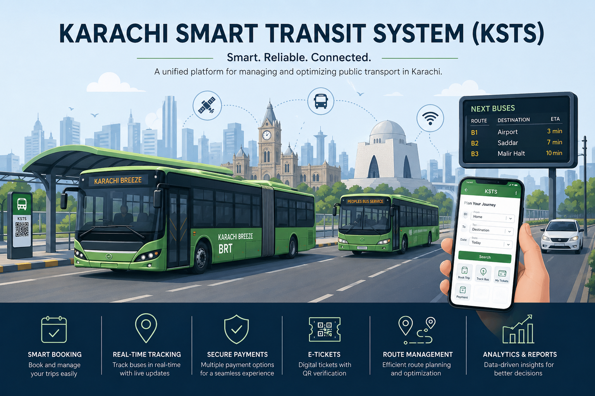

# 🚍 Karachi Smart Transit System (KSTS)

  

## 📌 Overview
**Karachi Smart Transit System (KSTS)** is a Software Design and Analysis project focused on modeling and optimizing public transportation in Karachi.

This repository contains **system design artifacts only**, including UML diagrams and architectural concepts.

---

## 🧩 Software Design Approach

### 🔄 Process Model
- Iterative / Agile Model
- Supports incremental development and continuous feedback
- Suitable for modular systems (Booking, Payment, Tracking, etc.)

---

## 📊 System Modeling & Diagrams

### 1. Use Case Diagram
Represents interactions between system actors and functionalities.

**Actors:**
- Passenger
- Admin
- Driver
- Payment Service

**Key Use Cases:**
- Register/Login
- Book Trip
- Cancel Booking
- Make Payment
- Generate Ticket
- Manage Routes & Trips

---

### 2. Class Diagram
Defines system structure with classes, attributes, methods, and relationships.

**Core Entities:**
- User (Base Class)
- Passenger, Admin, Driver (Inheritance)
- Route, Trip, Bus, Stop
- Booking, Ticket, Payment, Report

**Key Relationships:**
- Inheritance (User → Passenger/Admin/Driver)
- Composition (Route → Stops)
- Association (Trip ↔ Bus, Driver)
- Aggregation (Route → Trips)

---

### 3. BCE (Boundary-Control-Entity) Model

**Boundary Classes (UI Layer):**
- PassengerUI
- DriverUI
- AdminUI

**Control Classes (Logic Layer):**
- BookingController
- PaymentController
- TripController
- RouteController
- ReportController

**Entity Classes (Data Layer):**
- User, Trip, Booking, Payment, Ticket, etc.

---

### 4. Activity Diagrams
- Passenger Booking Flow
- Driver Ticket Validation

---

### 5. Sequence Diagrams
- Passenger Trip Booking
- Admin Trip Management
- Real-Time Bus Tracking

---

### 6. Deployment Diagram
**Components:**
- Client (Browser / React App)
- Application Server (Flask)
- Database Server (MySQL)

---

### 7. Timing Diagrams
- Trip Scheduling
- Booking Flow
- Real-Time Tracking Updates

---

## 🏗️ System Architecture (4+1 Model)

### Logical View
- Object-oriented structure (Class Diagram)

### Process View
- Concurrency handling (booking, payments)
- Real-time updates via WebSockets

### Development View
- Layered architecture:
  - Presentation
  - Application
  - Domain
  - Data

### Physical View
- 3-Tier Architecture:
  - Client Tier
  - Application Tier
  - Data Tier

### +1 Use Case View
- System functionality from user perspective

---

## ⚙️ Key Concepts Used

- UML Modeling
- Object-Oriented Design
- Layered Architecture
- 3-Tier Architecture
- Real-Time Systems (WebSockets)
- Database Design & ORM
- Agile Methodology

---

## 📌 Note
This repository focuses on **design and modeling only**.  
No implementation code is included.
